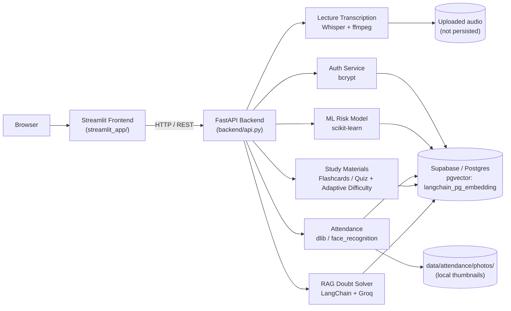

# Study Genie

**An AI-powered classroom intelligence platform** that turns lectures, PDFs, and student activity into grounded answers, study materials, attendance records, and personalized guidance.


## Overview

Study Genie combines a FastAPI backend with a Streamlit frontend to deliver a working slice of an EdTech platform: a RAG-based doubt solver over uploaded course PDFs, Whisper-powered lecture transcription with auto-generated notes, adaptive flashcard/quiz generation, face-recognition attendance, and a personalized study-plan engine driven by a lightweight ML risk model. Accounts are real (email/password, bcrypt-hashed), and each account is deterministically linked to a simulated classroom profile so the ML-driven features work immediately without months of real usage data. All persistent state — accounts, saved materials, quiz attempts, attendance, the classroom ML dataset, and the PDF knowledge base's vector embeddings — lives in a single **Supabase/Postgres** database (using the `pgvector` extension for the RAG vector store), rather than local files.

## Features

### Learn & Create
- **AI Doubt Solver** — upload course PDFs, build a shared knowledge base (pgvector + HuggingFace embeddings), and ask grounded questions with cited sources and chat history via Groq-hosted LLMs.
- **Lecture Transcription Studio** — turn lecture audio/video into a transcript (Whisper), plus an LLM-generated summary, key points, bullet notes, and topic tags.
- **Flashcards and Quiz Generator** — generate flashcards and multiple-choice quizzes from a transcript or PDFs. Quiz difficulty **adapts automatically**: a student's last 5 quiz scores bias new questions harder or easier.
- **Attendance Studio** — enroll a student's face once (`dlib` / `face_recognition`), then mark a whole class present from a single group photo, with bounding-box confirmation and full session history.

### Personalized Guidance
- **Personalized Study Plan** — answers a short question form (goal, plan length, daily time budget, exam date, a topic you're worried about) and turns a student's live risk score and weakest topics into a concrete day-by-day schedule ("Focus on Probability today. Revise Linear Algebra tomorrow.").
- **Doubt Frequency Tracking** — surfaced on the account Profile page: which topics generate disproportionate doubt volume, classroom-wide and per-student.

### Accounts
- Email/password signup and login (bcrypt-hashed passwords), a profile popover on every page, and a Profile page showing real activity: saved materials, quiz history, attendance record.
- Every new account is deterministically mapped to one of the simulated `S0001`–`S0500` classroom profiles, so risk scoring and study plans work from the first login — clearly separated from the student's *actual* tracked activity (saved materials, quiz attempts, attendance).

## Tech Stack

| Layer | Technology |
|---|---|
| Backend API | FastAPI, Pydantic, Uvicorn |
| Frontend | Streamlit (multipage, custom theme) |
| Database | Supabase (Postgres) via SQLAlchemy + psycopg3 |
| LLM / RAG | LangChain, Groq (Llama models), `langchain-postgres` + pgvector, HuggingFace sentence-transformers |
| Speech-to-text | OpenAI Whisper, ffmpeg |
| Face recognition | dlib, face_recognition, OpenCV |
| ML | scikit-learn (Logistic Regression / Random Forest risk model) |
| Data | pandas, numpy — synthetic classroom dataset seeded into Postgres |
| Auth | bcrypt, `users` table in Postgres |

## Architecture



Everything except the uploaded audio (processed in-memory/temp) and enrolled-face thumbnail photos (kept as local JPEGs, referenced by path from Postgres) lives in one Supabase Postgres database — see `supabase/schema.sql` for the full table list.

## Getting Started

### Prerequisites

- Python 3.11
- A free [Supabase](https://supabase.com/) project (Postgres database) — see **Database setup** below.
- [ffmpeg](https://ffmpeg.org/) on your `PATH` — required by Whisper transcription.
  - Windows: `winget install Gyan.FFmpeg`
  - macOS: `brew install ffmpeg`
  - Linux: use your package manager
- A C++ toolchain + CMake — required to build `dlib` for the attendance feature.
  - Windows: Visual Studio Build Tools (C++ workload) + CMake, installed before `pip install`
- A [Groq API key](https://console.groq.com/) for the LLM-powered features (doubt solving, note generation, flashcard/quiz generation)

### Installation

```bash
# 1. Clone and enter the project
git clone https://github.com/MohammadTouseef29/study-genie.git
cd study_genie

# 2. Create and activate a virtual environment
python -m venv venv
source venv/bin/activate        # macOS/Linux
venv\Scripts\activate           # Windows

# 3. Install dependencies
pip install -r requirements.txt

# 4. Configure environment variables
cp .env.example .env
# then edit .env and add your GROQ_API_KEY and DATABASE_URL (see below)
```

### Database setup (Supabase)

1. Create a project at [supabase.com](https://supabase.com/) (the free tier is enough).
2. In the dashboard: **Database → Extensions** → enable **vector** (pgvector).
3. In the dashboard: **Project Settings → Database → Connection string**, copy the URI, fill in your database password, and put the complete string in `.env` as `DATABASE_URL` (never commit the real value — `.env` is gitignored, `.env.example` should only ever hold a placeholder).
4. Run the setup script — it creates every table (idempotent, safe to re-run) and seeds the synthetic classroom dataset from `data/analytics/*.csv` so the ML risk model, study plan, and doubt-frequency features work immediately:

```bash
python scripts/migrate_to_supabase.py
```

(You can also run `supabase/schema.sql` directly in the Supabase SQL editor if you prefer not to seed the demo dataset.)

### Running

Start the backend (in one terminal):

```bash
uvicorn backend.api:app --reload
```

Start the frontend (in another terminal):

```bash
streamlit run streamlit_app/Home.py
```

The Streamlit app expects the backend at `http://localhost:8000` by default — override with the `STUDY_GENIE_API_URL` environment variable if needed.

## Project Structure

```
study_genie/
├── backend/
│   ├── api.py                 # FastAPI app and all route definitions
│   ├── db.py                  # Shared SQLAlchemy engine (reads DATABASE_URL)
│   ├── analytics/             # Doubt frequency analytics
│   ├── attendance/            # Face enrollment + group-photo attendance marking
│   ├── auth/                  # Signup/login, bcrypt hashing, profile aggregation
│   ├── ml/                    # Student risk-scoring model (Logistic Regression / Random Forest)
│   ├── rag/                   # PDF loading, chunking, pgvector store, QA pipeline
│   ├── study_materials/       # Flashcard/quiz generation, save + quiz scoring
│   ├── study_plan/            # Personalized day-by-day study plan generator
│   └── transcription/         # Whisper transcription + LLM note generation
├── streamlit_app/
│   ├── Home.py                # Streamlit navigation router
│   ├── home_page.py           # Landing dashboard
│   ├── ui.py                  # Shared theme, components, and auth UI
│   └── pages/                 # One file per feature page
├── supabase/
│   └── schema.sql             # Full Postgres schema (idempotent, safe to re-run)
├── scripts/
│   └── migrate_to_supabase.py # Applies schema.sql and seeds the classroom dataset
├── data/
│   ├── analytics/              # Source CSVs for the synthetic classroom dataset (seed data only)
│   ├── audio/                  # Sample audio for transcription testing
│   └── attendance/photos/       # Enrolled face thumbnails (gitignored; roster data itself is in Postgres)
└── notebooks/                  # Data generation / experimentation notebooks
```

Everything that used to be a runtime-generated CSV/JSON file (accounts, saved materials, quiz attempts, attendance logs, the attendance roster, the RAG vector index) now lives in Postgres instead — the files under `data/` are either static seed data (`data/analytics/*.csv`, loaded once by the migration script) or local binary assets (audio, face thumbnails).

## API Reference

**Doubt Solver**
- `POST /rag/ingest` — upload PDFs and build the knowledge base
- `POST /rag/query` — ask a grounded question with chat history

**Transcription**
- `POST /transcription/transcribe` — audio → transcript only
- `POST /transcription/process` — audio → transcript + summary + notes + tags

**Study Materials**
- `POST /study-materials/from-transcript` / `POST /study-materials/from-pdf` — generate flashcards + quiz (adaptive difficulty if `student_id` is given)
- `POST /study-materials/save`, `GET /study-materials/saved`, `GET /study-materials/{material_id}`
- `POST /study-materials/submit-quiz` — score an attempt

**Attendance**
- `POST /attendance/enroll`, `GET /attendance/roster`, `DELETE /attendance/roster/{student_id}`
- `POST /attendance/mark`, `GET /attendance/history`, `GET /attendance/history/{session_id}`

**Study Plan & Analytics**
- `GET /study-plan/{student_id}` — params: `days`, `daily_minutes`, `exam_date`, `priority_topic`, `goal`
- `GET /analytics/doubt-frequency` — optional `student_id`

**Accounts**
- `POST /auth/signup`, `POST /auth/login`, `GET /auth/profile/{user_id}`

## Notes & Current Limitations

- The classroom-wide Analytics Dashboard, Recommendations, Faculty Effectiveness, and Academic Integrity dashboards were removed in favor of focusing on the personalized, account-driven features above. The underlying ML risk model still powers Personalized Study Plan internally.
- New accounts are deterministically mapped to a simulated classroom profile (`S0001`–`S0500`) so risk scoring and study plans work immediately — this demo data is clearly labeled as such wherever it's shown. Saved materials, quiz attempts, and attendance are 100% real, tied to the account from day one.
- Login sessions live in Streamlit's `session_state` only (no persistent cookie yet), so a full page reload requires logging in again.
- Google login is not wired up — it requires a Google Cloud OAuth client that only the project owner can create. Streamlit's built-in `st.login()` supports it natively once credentials are added to `.streamlit/secrets.toml`.
- Personalized Study Plan requires an account and shows a "log in to view" wall otherwise.
- Backend code connects to Postgres through a single shared SQLAlchemy engine/connection pool (`backend/db.py`) rather than opening a new connection per request — this matters on Supabase's free tier, which caps concurrent direct connections. If you scale this beyond local/demo use, switch `DATABASE_URL` to Supabase's connection-pooler string (Session or Transaction mode) instead of the direct connection.
- Enrolled face thumbnails remain local JPEG files under `data/attendance/photos/` (referenced by path from the `attendance_roster` table) rather than being stored in the database — a deliberate "database for structured data + metadata, filesystem/object storage for image blobs" split, not a compromise.

